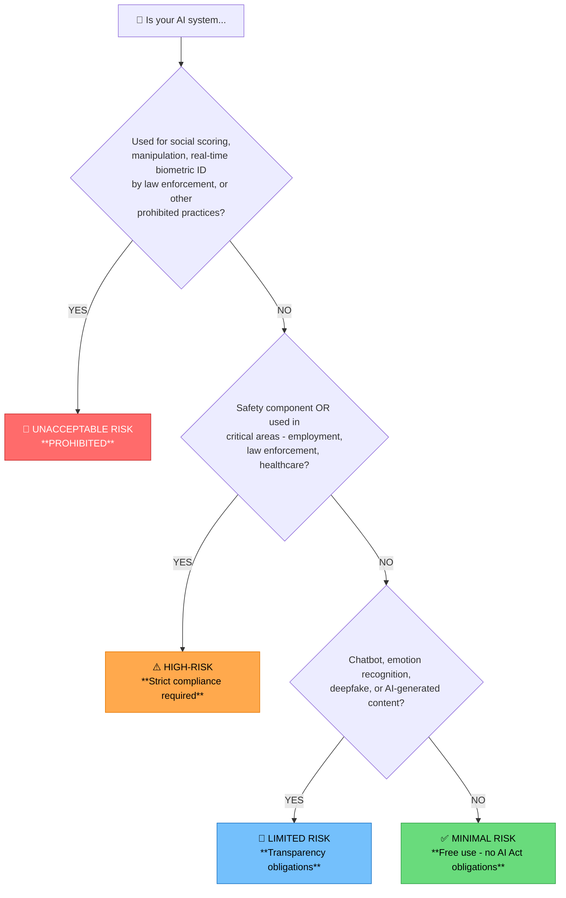
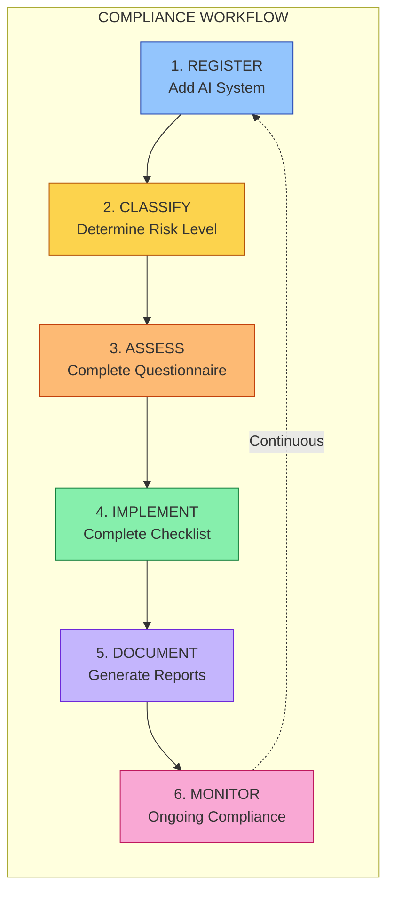
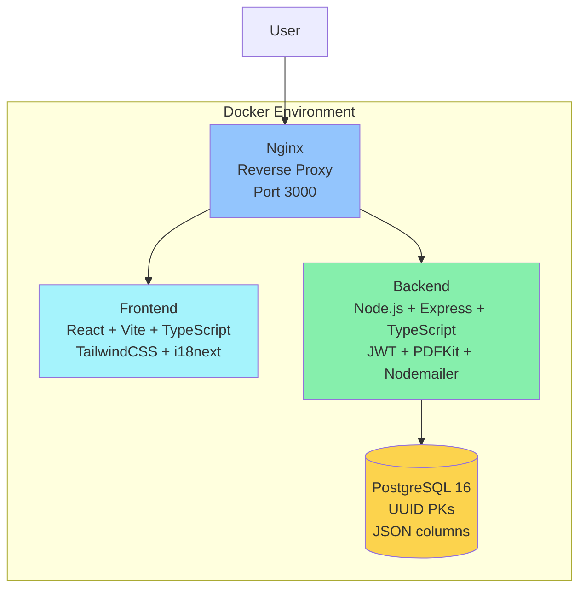
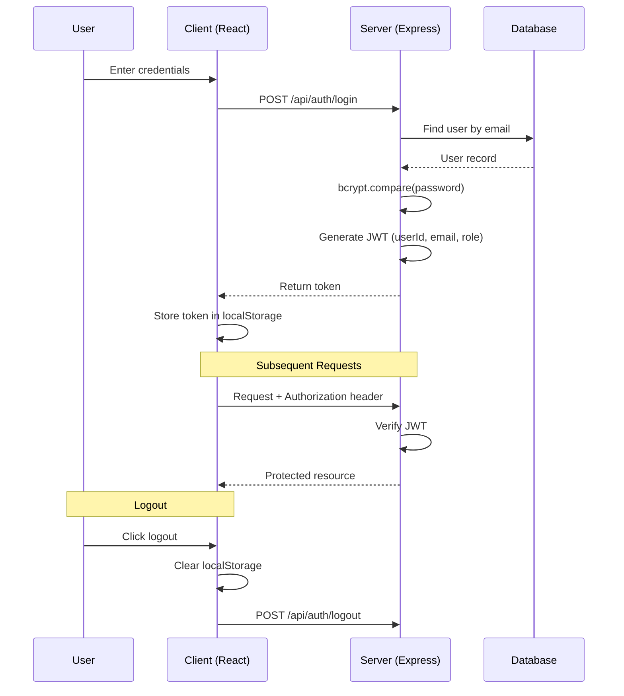
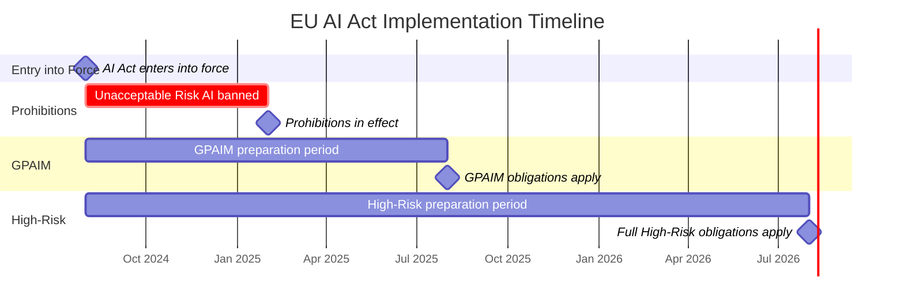

# EU AI Act Compliance & Project Identification Framework

> A comprehensive framework for understanding and implementing EU AI Act requirements

[](https://eur-lex.europa.eu/legal-content/EN/TXT/?uri=CELEX:32024R1689)
[](LICENSE)

---

## Table of Contents

- [Quick Start: Risk Classification](#quick-start-risk-classification-decision-tree)
- [1. Introduction](#1-introduction)
- [2. How to Use This Framework](#2-how-to-use-this-framework)
- [3. Risk Levels Overview](#3-risk-levels-overview-eu-ai-act)
- [4. General Purpose AI Models & Generative AI](#4-general-purpose-ai-models-gpaims--generative-ai)
- [5. Key Compliance Areas](#5-key-compliance-areas-especially-for-high-risk--gpaims)
- [6. Interaction with GDPR](#6-interaction-with-gdpr)
- [7. Web Application](#7-web-application)
- [8. Framework Resources](#8-framework-resources)
- [9. Official References](#9-official-references)
- [10. Contributing](#10-contributing)

---

## Quick Start: Risk Classification Decision Tree



---

## 1. Introduction

This framework provides a structured approach to understanding the European Union's Artificial Intelligence Act (AI Act) and its implications for AI projects. It is based on the comprehensive guide provided ("The EU AI Act: Comprehensive Guide for Generative AI Compliance") and aims to help teams:

- **Identify AI Projects:** Recognize activities that fall under the scope of AI regulation.
- **Classify Risk Levels:** Understand the AI Act's risk-based categorization (Unacceptable, High, Limited, Minimal).
- **Assess Potential & Risks:** Evaluate the capabilities and potential harms associated with AI systems at different risk levels.
- **Identify Technologies:** Recognize common AI technologies and their associated regulatory considerations.
- **Navigate Compliance:** Access relevant requirements, templates, and resources based on the AI Act.

The EU AI Act is the world's first comprehensive legal framework for AI, aiming to ensure safety, protect fundamental rights, foster innovation, and create a single market for trustworthy AI within the EU.

**Disclaimer:** This framework is for informational purposes only and does not constitute legal advice. Always consult with qualified legal professionals for specific compliance guidance regarding the EU AI Act.

## 2. How to Use This Framework

This framework is organized based on the AI Act's risk classification system:

1.  **Review Risk Levels:** Start by understanding the four main risk categories defined by the Act. Each category has a dedicated directory:
    - [`./0_unacceptable_risk/`](./0_unacceptable_risk/)
    - [`./1_high_risk/`](./1_high_risk/)
    - [`./2_limited_risk/`](./2_limited_risk/)
    - [`./3_minimal_risk/`](./3_minimal_risk/)
2.  **Explore Specific Risks:** Navigate to the directory corresponding to the potential risk level of your project or area of interest. Each directory contains a `README.md` detailing:
    - Definition and criteria for the risk level.
    - Examples of AI systems in that category.
    - Key obligations and requirements.
    - Associated technologies and specific risks.
3.  **Utilize Resources:** Access supporting materials for compliance efforts:
    - **Templates:** [`./templates/`](./templates/) contains templates for documentation, risk assessment, and DPIAs based on the Act's requirements.
    - **Resources:** [`./resources/`](./resources/) includes a compliance checklist and a glossary of key terms.

## 3. Risk Levels Overview (EU AI Act)

The AI Act categorizes AI systems into four tiers based on potential risk:

- **Unacceptable Risk:** AI practices that pose a clear threat to safety, livelihoods, and fundamental rights. These systems are **prohibited**.

  - _Examples:_ Governmental social scoring, manipulative AI targeting vulnerabilities, most real-time remote biometric identification in public spaces by law enforcement.
  - _Details:_ [`./0_unacceptable_risk/README.md`](./0_unacceptable_risk/README.md)

- **High-Risk:** AI systems with significant potential impact on health, safety, fundamental rights, or critical societal functions. These systems face **strict obligations** before market entry and throughout their lifecycle.

  - _Examples:_ AI in critical infrastructure, medical devices, recruitment, essential services, law enforcement, justice administration.
  - _Details:_ [`./1_high_risk/README.md`](./1_high_risk/README.md)

- **Limited Risk:** AI systems requiring specific **transparency obligations** so users know they are interacting with AI or viewing AI-generated content.

  - _Examples:_ Chatbots, emotion recognition systems, biometric categorization, deepfakes/AI-generated content.
  - _Details:_ [`./2_limited_risk/README.md`](./2_limited_risk/README.md)

- **Minimal or No Risk:** AI systems posing little to no risk. The Act allows **free use** of these systems, representing the vast majority of AI applications.
  - _Examples:_ AI-enabled video games, spam filters, basic recommendation systems.
  - _Details:_ [`./3_minimal_risk/README.md`](./3_minimal_risk/README.md)

## 4. General Purpose AI Models (GPAIMs) & Generative AI

The Act includes specific rules for GPAIMs, particularly foundation models and generative AI:

- **GPAIMs:** Models applicable to a wide range of tasks. They face specific requirements, especially those deemed to have **Systemic Risk** due to their capabilities and potential impact.
- **Generative AI:** Systems creating novel content (text, images, audio, video) have specific transparency duties:
  - Disclose AI generation.
  - Publish summaries of training data (respecting copyright).
  - Design to prevent illegal content generation.
  - Implement technical watermarking/labeling.

## 5. Key Compliance Areas (Especially for High-Risk & GPAIMs)

- **Risk Management System:** Continuous identification, evaluation, mitigation, and monitoring of risks.
- **Data Governance:** Ensuring quality, representativeness, and legality (including copyright) of training, validation, and testing data; bias mitigation.
- **Technical Documentation:** Detailed records of system design, training, performance, limitations, and compliance measures.
- **Record-Keeping:** Logging system events for traceability.
- **Transparency & User Information:** Clear disclosure of AI interaction, system capabilities, limitations, and instructions for use.
- **Human Oversight:** Designing systems to allow effective human monitoring, intervention, and control.
- **Accuracy, Robustness & Cybersecurity:** Ensuring systems perform reliably and securely.

## 6. Interaction with GDPR

The AI Act complements the GDPR. Compliance often requires an integrated approach, particularly for AI systems processing personal data. Key overlaps include principles like transparency, data minimization, purpose limitation, and risk assessment (e.g., extending DPIAs). See [`./templates/dpia_plus_template.md`](./templates/dpia_plus_template.md).

## 7. Web Application

This framework includes a comprehensive **web-based compliance tool** for managing EU AI Act compliance activities.

### 7.1 What Does The Tool Do?

The EU AI Act Compliance Tool is a **complete compliance management platform** that helps organizations:

| Function | Description |
|----------|-------------|
| **Inventory AI Systems** | Maintain a centralized registry of all AI systems requiring compliance assessment |
| **Classify Risk Levels** | Automatically determine the risk classification based on EU AI Act criteria |
| **Conduct Assessments** | Guide users through structured risk assessment questionnaires |
| **Track Compliance** | Monitor progress through phase-based compliance checklists |
| **Generate Documentation** | Produce PDF reports for auditors and regulatory bodies |
| **Manage Teams** | Role-based access for compliance managers, assessors, and stakeholders |

### 7.2 Key Workflows



### 7.3 Target Users

| Role | Use Case |
|------|----------|
| **Compliance Officers** | Oversee organizational AI compliance, generate executive reports |
| **Legal Teams** | Assess regulatory obligations, document conformity |
| **IT/AI Teams** | Register systems, provide technical documentation |
| **Risk Managers** | Evaluate and monitor AI-related risks |
| **Auditors** | Review compliance status, access audit trails |
| **Executive Leadership** | Dashboard overview of compliance posture |

### 7.4 Benefits

#### For Organizations

| Benefit | Description |
|---------|-------------|
| **Avoid Penalties** | Structured approach ensures compliance before enforcement deadlines |
| **Reduce Complexity** | Simplified workflows break down complex regulations into manageable tasks |
| **Centralized Management** | Single platform for all AI compliance activities |
| **Audit Readiness** | Complete documentation and audit trails for regulatory inspections |
| **Multi-language** | Support for 6 EU languages enables organization-wide adoption |

#### For Compliance Teams

| Benefit | Description |
|---------|-------------|
| **Guided Assessments** | Step-by-step questionnaires based on official EU AI Act criteria |
| **Automated Classification** | AI-assisted preliminary risk classification |
| **Progress Tracking** | Visual dashboards show compliance status at a glance |
| **Collaboration** | Role-based access enables team coordination |
| **Report Generation** | One-click PDF reports for stakeholders and regulators |

#### Technical Benefits

| Benefit | Description |
|---------|-------------|
| **Modern Stack** | React + Node.js + PostgreSQL for reliability and performance |
| **Docker Deployment** | Easy installation with docker-compose |
| **API-First** | Full REST API with Swagger documentation for integrations |
| **Secure by Design** | JWT authentication, encryption, audit logging |
| **Extensible** | Modular architecture for customization |

### 7.5 Features

#### Core Functionality

- **AI System Registry**: Catalog and manage all AI systems requiring compliance
- **Risk Classification**: Automated preliminary classification based on AI Act criteria
- **Risk Assessment Questionnaire**: Comprehensive assessment workflow with audit trail
- **Compliance Checklists**: Phase-based checklists with evidence attachment support
- **Report Generation**: PDF export for compliance, risk, and technical documentation

#### Enterprise Features

- **Multi-language Support**: Available in 6 EU languages (EN, PT, ES, DE, FR, IT)
- **Email Notifications**: Automated alerts for assessment deadlines and updates
- **Role-Based Access Control**: Admin, Manager, Assessor, and Viewer roles
- **Audit Logging**: Complete trail of all user actions for compliance
- **API Documentation**: Full Swagger/OpenAPI documentation for integrations

#### Internationalization (i18n)

The platform uses **i18next** with **Intlayer** for translation management:

| Feature | Description |
|---------|-------------|
| **6 Languages** | English, Portuguese, Spanish, German, French, Italian |
| **Type-Safe** | Content declarations in TypeScript with full autocomplete |
| **AI Translation** | Optional AI-powered automatic translation filling |
| **i18next Compatible** | Seamless integration with existing i18next setup |

**Translation Workflow:**

```bash
# Build translations from content declarations
npm run translate

# Fill missing translations using AI (requires API key)
npm run translate:fill
```

**Content Structure:**
```
webapp/frontend/src/
├── content/           # Intlayer content declarations
│   ├── common.content.ts
│   ├── auth.content.ts
│   ├── dashboard.content.ts
│   └── ...
├── locales/           # Generated i18next JSON files
│   ├── en.json
│   ├── pt.json
│   └── ...
└── i18n.ts            # i18next configuration
```

> **Note**: Intlayer is licensed under Apache 2.0, compatible with this project's MIT license.

### 7.6 Quick Start

#### Prerequisites

- Docker Desktop 20.10+
- Docker Compose 2.0+
- Node.js 18+ (for local development only)

#### Production Deployment

```bash
cd webapp
cp .env.example .env
# Edit .env with your settings
docker-compose up -d
```

**Access the application:**
- Web App: http://localhost:3000
- API Docs: http://localhost:4000/api/docs
- Health Check: http://localhost:4000/api/health

#### Default Test Users

| Email | Password | Role |
|-------|----------|------|
| `admin@euaiact.local` | `admin123` | admin |
| `test@example.com` | `TestPassword123` | admin |

⚠️ **Security Warning**: Change or remove default credentials in production!

### 7.7 Architecture



### 7.8 API Endpoints

#### Authentication
| Method | Endpoint | Description |
|--------|----------|-------------|
| POST | `/api/auth/register` | Register new user |
| POST | `/api/auth/login` | Authenticate user |
| POST | `/api/auth/logout` | Logout current user |
| GET | `/api/auth/me` | Get current user |
| POST | `/api/auth/forgot-password` | Request password reset |
| POST | `/api/auth/reset-password` | Reset password with token |

#### AI Systems
| Method | Endpoint | Description |
|--------|----------|-------------|
| GET | `/api/systems` | List all systems |
| POST | `/api/systems` | Create new system |
| GET | `/api/systems/:id` | Get system details |
| PUT | `/api/systems/:id` | Update system |
| DELETE | `/api/systems/:id` | Delete system |
| POST | `/api/systems/:id/classify` | Run AI classification |

#### Risk Assessments
| Method | Endpoint | Description |
|--------|----------|-------------|
| GET | `/api/assessments/system/:systemId` | Get system assessments |
| POST | `/api/assessments` | Start new assessment |
| GET | `/api/assessments/:id` | Get assessment details |
| PUT | `/api/assessments/:id` | Update responses |
| POST | `/api/assessments/:id/complete` | Finalize assessment |
| GET | `/api/assessments/questions` | Get question catalog |

#### Compliance Checklist
| Method | Endpoint | Description |
|--------|----------|-------------|
| GET | `/api/checklists/system/:systemId` | Get system checklist |
| GET | `/api/checklists/system/:systemId/progress` | Get completion stats |
| PATCH | `/api/checklists/items/:id` | Update item status |
| POST | `/api/checklists/system/:systemId/generate` | Generate from template |

#### Reports
| Method | Endpoint | Description |
|--------|----------|-------------|
| GET | `/api/reports/system/:systemId/compliance` | Compliance report data |
| GET | `/api/reports/system/:systemId/risk-assessment` | Risk assessment report |
| GET | `/api/reports/system/:systemId/:type?format=pdf` | Download PDF report |
| GET | `/api/reports/dashboard` | Dashboard statistics |

#### User Management (Admin Only)
| Method | Endpoint | Description |
|--------|----------|-------------|
| GET | `/api/users` | List all users |
| GET | `/api/users/profile` | Get current user profile |
| PUT | `/api/users/profile` | Update profile |
| PUT | `/api/users/password` | Change password |
| PUT | `/api/users/:id/role` | Update user role |
| DELETE | `/api/users/:id` | Delete user |

### 7.9 User Management

#### User Roles

| Role | Description | Permissions |
|------|-------------|-------------|
| `admin` | System administrator | Full access, manage users and roles |
| `manager` | Compliance manager | Create/edit systems, assessments, reports |
| `assessor` | Risk assessor | Complete assessments and checklists |
| `viewer` | Read-only access | View systems and reports only |

#### Permission Matrix

| Resource | viewer | assessor | manager | admin |
|----------|--------|----------|---------|-------|
| View systems | ✓ | ✓ | ✓ | ✓ |
| Create systems | ✗ | ✗ | ✓ | ✓ |
| Edit systems | ✗ | ✗ | ✓ | ✓ |
| Delete systems | ✗ | ✗ | ✗ | ✓ |
| Complete assessments | ✗ | ✓ | ✓ | ✓ |
| Generate reports | ✗ | ✓ | ✓ | ✓ |
| Manage users | ✗ | ✗ | ✗ | ✓ |

#### Adding Users

**Option 1: Self-Registration (Web UI)**
1. Navigate to login page → Click "Register"
2. Fill in email, name, password, organization
3. New users get `viewer` role by default

**Option 2: API Registration**
```bash
curl -X POST http://localhost/api/auth/register \
  -H "Content-Type: application/json" \
  -d '{"email":"user@example.com","password":"SecurePass123!","name":"John Doe"}'
```

#### Changing User Roles (Admin Only)

```bash
# Get auth token
TOKEN=$(curl -s -X POST http://localhost/api/auth/login \
  -H "Content-Type: application/json" \
  -d '{"email":"admin@euaiact.local","password":"admin123"}' | jq -r '.token')

# Update role
curl -X PUT http://localhost/api/users/{user-id}/role \
  -H "Authorization: Bearer $TOKEN" \
  -H "Content-Type: application/json" \
  -d '{"role": "manager"}'
```

#### Removing Users (Admin Only)

```bash
curl -X DELETE http://localhost/api/users/{user-id} \
  -H "Authorization: Bearer $TOKEN"
```

**Self-Protection Rules:**
- Users cannot change their own role
- Users cannot delete their own account
- At least one admin must exist

### 7.10 Security Features

#### Authentication & Sessions

- **JWT-based Authentication**: Stateless tokens with configurable expiration
- **bcrypt Password Hashing**: 12 salt rounds (OWASP recommended)
- **Automatic Token Injection**: Axios interceptors handle auth headers
- **Session Invalidation**: 401 responses trigger automatic logout
- **Last Login Tracking**: Recorded for security monitoring

**Session Flow:**



#### API Security

- **Rate Limiting**: 100 req/15min global, 5 req/min for auth endpoints
- **Input Validation**: express-validator on all inputs
- **SQL Injection Prevention**: Parameterized queries throughout
- **XSS Prevention**: Helmet.js security headers

#### HTTP Security Headers (Helmet.js)

- `X-Frame-Options: SAMEORIGIN` - Prevents clickjacking
- `X-Content-Type-Options: nosniff` - Prevents MIME sniffing
- `X-XSS-Protection: 1; mode=block` - Browser XSS filter
- `Strict-Transport-Security` - Enforces HTTPS
- `Content-Security-Policy` - Controls resource loading

#### Audit Logging

```sql
audit_logs (
    id UUID PRIMARY KEY,
    user_id UUID,           -- Who
    action VARCHAR(100),    -- What
    entity_type VARCHAR,    -- What type
    entity_id UUID,         -- Which
    old_values JSONB,       -- Before
    new_values JSONB,       -- After
    ip_address INET,        -- From where
    created_at TIMESTAMP    -- When
)
```

**Logged Actions:** Authentication, user management, system CRUD, assessments, checklist completions, report generation

#### Data Protection & Privacy (GDPR)

| Principle | Implementation |
|-----------|----------------|
| **Data Minimization** | Only essential user data collected |
| **Purpose Limitation** | Data used only for compliance management |
| **Storage Limitation** | Configurable data retention policies |
| **Integrity & Confidentiality** | Encrypted storage, secure transmission |
| **Accountability** | Full audit trail of all operations |

### 7.11 Production Security Checklist

**Authentication & Access:**
- [ ] Change default JWT secret (`JWT_SECRET`) - use 256+ bit random string
- [ ] Set appropriate JWT expiration (`JWT_EXPIRES_IN`)
- [ ] Remove or change default test user credentials
- [ ] Review and restrict user role assignments

**Infrastructure:**
- [ ] Use strong database password (32+ characters)
- [ ] Enable HTTPS/TLS in Nginx with valid certificates
- [ ] Configure proper CORS origins (not wildcard)
- [ ] Enable firewall rules for database port

**Monitoring & Backup:**
- [ ] Set up database backups (daily minimum)
- [ ] Configure log rotation and retention
- [ ] Enable application monitoring/alerting
- [ ] Review audit logs regularly

### 7.12 Environment Variables

| Variable | Description | Default |
|----------|-------------|---------|
| `NODE_ENV` | Environment mode | `development` |
| `PORT` | Backend port | `4000` |
| `DATABASE_URL` | PostgreSQL connection string | Required |
| `JWT_SECRET` | JWT signing key (256+ bits) | Required |
| `JWT_EXPIRES_IN` | Token expiration | `7d` |
| `SMTP_HOST` | Email server | Optional |
| `SMTP_PORT` | Email port | `587` |
| `SMTP_USER` | Email username | Optional |
| `SMTP_PASS` | Email password | Optional |
| `FRONTEND_URL` | Frontend URL for email links | `http://localhost` |

### 7.13 Troubleshooting

**Database Connection Issues:**
```bash
docker-compose ps postgres          # Check status
docker-compose logs postgres        # View logs
docker-compose down -v && docker-compose up -d  # Reset
```

**API Not Responding:**
```bash
curl http://localhost:4000/api/health  # Health check
docker-compose logs -f backend         # View logs
```

**Frontend Build Errors:**
```bash
rm -rf node_modules package-lock.json && npm install
rm -rf node_modules/.vite  # Clear Vite cache
```

---

## 8. Framework Resources

### Templates

Located in [`./templates/`](./templates/):

| Template | Purpose |
|----------|---------|
| [`risk_assessment_template.md`](./templates/risk_assessment_template.md) | Comprehensive risk identification, evaluation, and mitigation planning |
| [`model_documentation_template.md`](./templates/model_documentation_template.md) | Technical documentation for AI systems including architecture and compliance |
| [`training_data_documentation_template.md`](./templates/training_data_documentation_template.md) | Data governance, sources, quality, and bias assessment |
| [`dpia_plus_template.md`](./templates/dpia_plus_template.md) | Integrated GDPR DPIA with AI Act considerations |

### Resources

Located in [`./resources/`](./resources/):

| Resource | Purpose |
|----------|---------|
| [`compliance_checklist.md`](./resources/compliance_checklist.md) | Phase-by-phase checklist for AI Act compliance |
| [`glossary.md`](./resources/glossary.md) | Key terms and definitions from the EU AI Act |
| [`technology_guidelines.md`](./resources/technology_guidelines.md) | Best practices for AI, Cloud, and LLM technologies |

---

## 9. Official References

- **EU AI Act Official Text:** [Regulation (EU) 2024/1689](https://eur-lex.europa.eu/legal-content/EN/TXT/?uri=CELEX:32024R1689)
- **European Commission AI Page:** [Artificial Intelligence](https://digital-strategy.ec.europa.eu/en/policies/european-approach-artificial-intelligence)

### AI Act Implementation Timeline



**Key Dates:**
- **August 1, 2024:** AI Act enters into force
- **February 2, 2025:** Prohibitions on unacceptable risk AI practices apply
- **August 2, 2025:** GPAIM obligations apply
- **August 2, 2026:** Full application for high-risk AI systems

---

## 10. Contributing

Contributions to improve this framework are welcome. Please consider:

1. Opening an issue to discuss proposed changes
2. Ensuring updates align with the official EU AI Act text
3. Maintaining consistency with the existing structure
4. Adding references to official sources where applicable

---

## Version History

| Version | Date | Changes |
|---------|------|---------|
| 1.0.0 | 2024 | Initial framework release |
| 1.1.0 | 2025-01 | Added technology guidelines, improved documentation structure |
| 2.0.0 | 2025-01 | Added comprehensive web application for compliance management |
| 2.1.0 | 2025-01 | Added Intlayer integration for improved translation management |

---

**Disclaimer:** This framework is for informational purposes only and does not constitute legal advice. Always consult with qualified legal professionals for specific compliance guidance regarding the EU AI Act.

_This framework is based on the document "The EU AI Act: Comprehensive Guide for Generative AI Compliance" and reflects the state of the Act as understood from that document._
